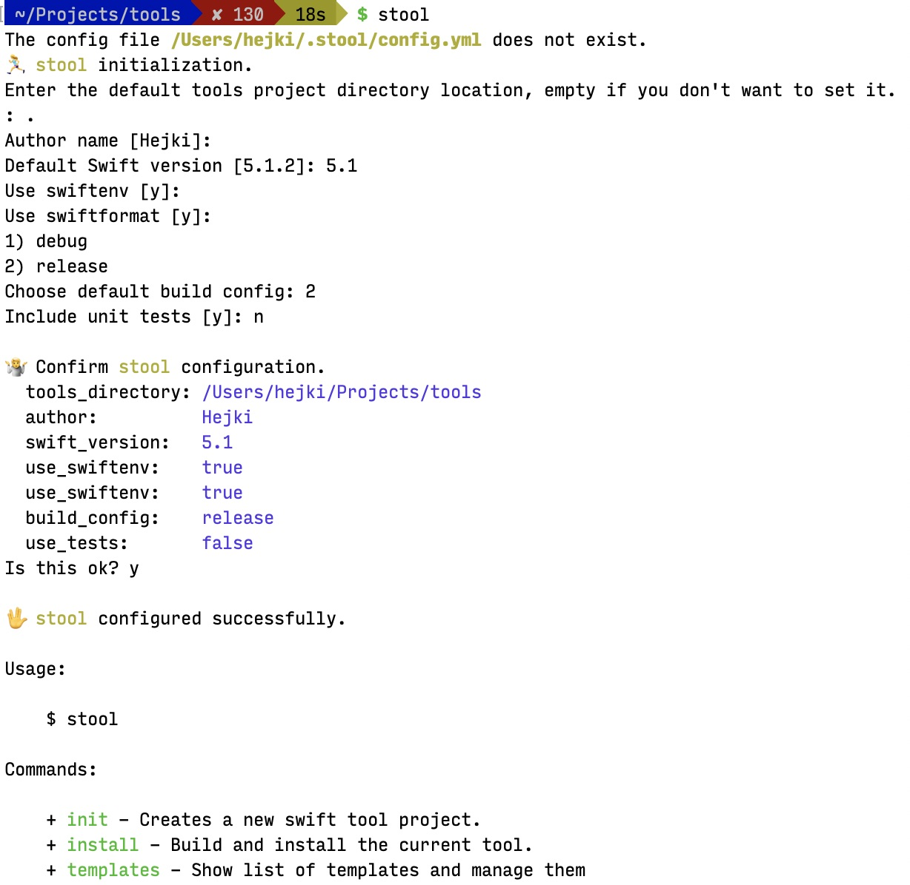

# 🧰 stool
![badge-swift][] ![badge-platforms][] [![badge-spm][]][spm-link] [![badge-ci][]][ci] [![badge-licence][]][licence]

The `stool` is command line tool that makes it easy to create and install your Swift tools.

## Quick Overview

#### Create project and open XCode
```shell
$ stool init myTool
> Tool directory [/path/to/current/directory/myTool]: ⏎
> 🙌 Tool myTool was created at /path/to/current/directory/myTool
```

#### Build and install you tool
```shell
$ stool install
> [2/2] Linking myTool
> 👍 myTool was installed to /usr/local/bin/
```

## Instalation

For install *stool* command to your local machine, clone this repository and build *stool* to install *stool*.

```shell
$ git clone https://github.com/Hejki/stool
$ cd stool
$ swift run stool install
```

That will build *stool* command and install it into `/usr/local/bin` folder. The install folder you can change in `.stool.yml` config file.

## Complete Usage Overview

#### First run

If you run *stool* for first time you must set global configuration properties.



#### Create a new tool project

Call `stool init` or `stool init name_or_path_to_tool_directory` to create a new tool project. You can use `--template` option to define project template.

#### Manage templates

Command `stool template` is used for managing project templates.

* `template list` – shows all installed templates
* `template default` – copy a default template to the templates directory
* `template add name` – adds a copy of default template with the specified *name*
* `template remove name` – removes a template with the specified *name*

## Configuration Files

#### Project Config

To install a tool using `stool install`, you need to have a configuration file `.stool.yml` in the project directory. This config file define how to install the tool.

```yaml
# Path to location where to copy tool target
install_path: /usr/local/bin/

# Swift build configuration, either release or debug
build_config: release
```

#### Global Config

Global *stool* configuration file is stored at path `~/.stool/config.yml` and contains a path to the default directory for tool projects and variables for project templates.

```yaml
# The default path for tool projects
tools_directory: /Users/hejki/Projects/tools
variables:
  # Defines Swift version
  swift_version: 5.1
  # The tool author's name
  author: Hejki
  # The Swift build configuration for .stool.yml
  build_config: release
  # Specifies whether to create a swiftenv version file
  use_swiftenv: true
  # Specifies whether to create a swiftformat config file
  use_swiftformat: true
  # Specifies whether to create a tests
  use_tests: false
```

## Custom templates

New projects can be created with specific template using `--template` or `-t` option. If you don't do that then default template will be used. Templates must be stored in `~/.stool/templates` directory. Template is a directory with predefined project structure. This structure is copied to the destination when you create a new project. File contents and file and directory names may contain variables and tags of the [Stencil templating language](http://stencil.fuller.li/en/latest/), these items are replaced when copying. The file will not be copied if it has an empty name after the template is evaluated.

#### The default project structure

The default project structure looks like:
```
├── LICENSE
├── Package.swift
├── Sources
│   └── main.swift
├── .swift-version
├── .swiftformat
└── Tests
    └── {{target}}Tests
        └── {{target}}Tests.swift
```

#### Create own custom template (examples)

Use `stool template add newTemplate` command to create the new copy of the default template. This creates a new template directory `~/.stool/templates/newTemplate`, then you can modify it.

In templates you can use variables from the global config file `~/.stool/config.yml` (like `swift_version`, `author` etc.). You can define own with `--variable` or `-v` when you launch *stool* init action. And also you can use `currentDate` with current Date instance, `name` with the project name and `target` which is capitalized project *name*.

For example when you use `stool init -v version=2.3 -v author=Spider-Man newTool` you have available these variables:
* *currentDate*, *name* `newTool` and *target* `NewTool`
* *swift_version*, *build_config*, *use_tests* and others from `~/.stool/config.yml`
* *version* and *author* from command line, where *author* overrides the same variable from configuration file.

[badge-swift]: https://img.shields.io/badge/Swift-5.1-orange.svg?logo=swift?style=flat
[badge-spm]: https://img.shields.io/badge/spm-compatible-brightgreen.svg?style=flat
[spm-link]: https://swift.org/package-manager
[badge-platforms]: https://img.shields.io/badge/platform-mac-lightgray.svg?style=flat
[badge-ci]: https://travis-ci.com/Hejki/stool.svg
[ci]: https://travis-ci.com/Hejki/stool
[badge-licence]: https://img.shields.io/badge/license-MIT-black.svg?style=flat
[licence]: https://github.com/Hejki/stool/blob/master/LICENSE